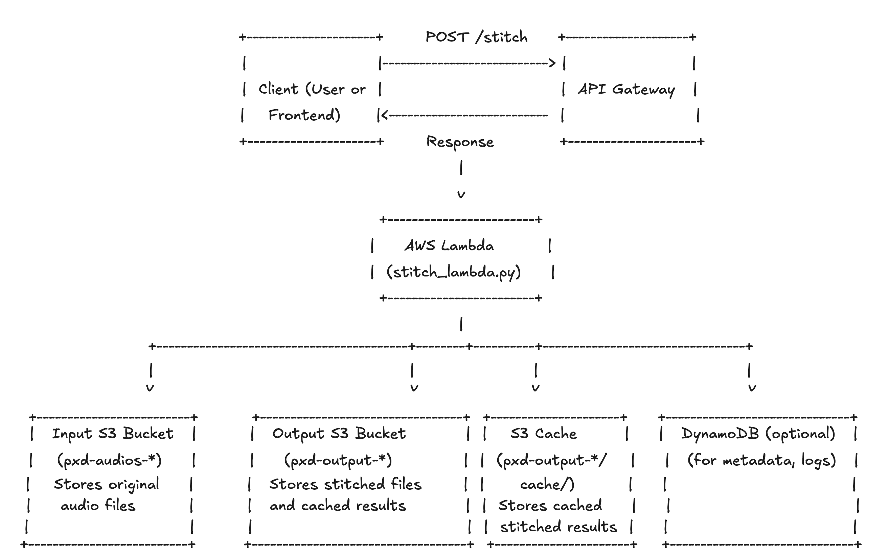

# AWS/Python Technical Assessment

## Setup

In a linux terminal where python is installed and available, run:

```bash
bash setup.sh
```

Then record two audio files:

`hello.wav`: Say "hello" in this audio file
`shreeshail.wav`: Say your name in this audio file

Save them to `./audios` and execute:

```bash
bash run.sh
```

That will generate an audio file called `hello__shreeshail.mp3` which is a stitched audio of `hello.wav` and `shreeshail.wav`.

Try running the `stitch.py` script with different messages (once you record the appropriate audio files).

## How it works

The `stitch.py` script when running locally takes as input a text message, a root audio file directory, and the full file path of the stitched audio file that will be generated from the text message.

Once the input paramters are provided, it will generate a repository (in this case a local reposity) that
will be used to list all of the files in the root audio file directory.  It will also be used to load the
audio file contents and to save the stitched audio file.

There is some additional complexity and helper functions.

## Test

As part of our interview process, we have a programming challenge. The goal is for you to become familiar with the technology we use and demonstrate your engineering proficiency.

✅ Your first task is to add code to the BucketRepo class so that it works when called from an AWS lambda function.

✅ The `lambda_handler` function, as the name implies, is the signature that should be used in the lambda.

✅ You will need to add the lambda layers necessary to include the libraries specified in requirements.txt.
✅ The lambda should return the success/failure of creating the stitched audio file, OR, the auctual stitched
audio file contents (extra bonus points for this).

✅ Once you have completed it the code, or during as you prefer, you should deploy the lambda to AWS, provide the proper permissions so that it can perform its work, and allow it to be accessible via a public API.

//TODO You can write the necessary steps and actions required to do this, record yourself doing it, or if you would like extra points, use one of the various tools to deploy the lambda (e.g. terraform, zip file, etc.)

✅ Your final task, if you choose to accept it, is to make the lambda publicly accessible through an API endpoint.  PxD staff should be able to call it using a curl command.  Extra points for making this API and the lambda calls secure.

API Endpoint : https://alnsxs4duwimivhdmxxc5ic6gu0jnczo.lambda-url.ap-south-1.on.aws/

Sample Output 
{
  "success": true,
  "message": "Stitched audio retrieved from cache!",
  "audio_files": [
    "hello.wav",
    "shreeshail.wav"
  ],
  "output_file": "cache/87839e88254723e71ec06db5a8bc944b343d9cb52dceb1189099284ce7327875.mp3",
  "public_url": "https://pxd-output.s3.amazonaws.com/cache/e71ec06db<TRUNCATED>1189099284ce7327875.mp3?  <--- you can access the stiched audio file and its secure presigned url X-Amz-Algorithm=AWS4-HMAC-SHA256&",
  "cached": true
}

Additional bonus points and tasks:

✅ 1) Add functionality to cache already stitched messages.

✅ 2) Use software engineering best practices to document your work and prepare it for deployment in one or more environments.  Hint: change control, CI/CD, etc.

//TODO 3) EXTRA SUPER BONUS: Make all your infrastructure and code deployable to Dev/Test/Stage/Prod environments with appropriate security AND a test suite which tests functionality (unit tests, integration tests, functional tests) before and after the deployment (as appropriate)


Architecture Diagram :

- 

- [Excalidraw](https://excalidraw.com/#json=bb6bLCWPNt7ZJU9Ntih-A,v4vVDNsrykl0aNlGH4YLxg)
---

## Flow

1. **Client** sends a request to the **API Gateway** (POST `/stitch` with audio file keys to stitch).
2. **API Gateway** triggers the **Lambda function**.
3. **Lambda** checks if a stitched version for the requested combination exists in the **Output S3 Bucket** under the `cache/` prefix.
    - If cached, returns the URL to the cached file.
    - If not, downloads audio parts from the **Input S3 Bucket**, stitches them, uploads the result to the cache area of the **Output S3 Bucket**, and returns the new URL.
4. **S3 Lifecycle rules** automatically remove old cache files after a set period.

---

## Key AWS Resources

- **API Gateway**: REST API entry point.
- **Lambda**: Runs the stitching, cache check, and S3 interaction logic.
- **Input S3 Bucket**: Holds user-uploaded audio files.
- **Output S3 Bucket**: Holds stitched and cached audio files.
- **IAM Roles**: Secure, least-privilege access for Lambda to S3.

---

## Security & Operations

- Buckets are private by default.
- IAM roles defined per environment.
- S3 cache uses lifecycle expiration.
- Deployed/tested via CI/CD pipelines.

---
## Example Project Structure

```plaintext
.
├── src/
│   ├── stitch.py
│   ├── stitch_lambda.py
│   ├── bucket_repo.py
│   ├── TROUBLESHOOTING_GUIDE.md
│   ├── AUDIO_STICHER_DOCUMENT.md
├── tests/ //TODO
│   └── test_stitch.py //TODO
├── serverless.yml //TODO
├── requirements.txt
├── run.sh
├── setup.sh
├── README.md
└── .github/ //TODO
    └── workflows/
        └── ci.yml
```


---

## Contributors

- [Shreeshail G](mailto:shreeshailgumgeri@gmail.com)
