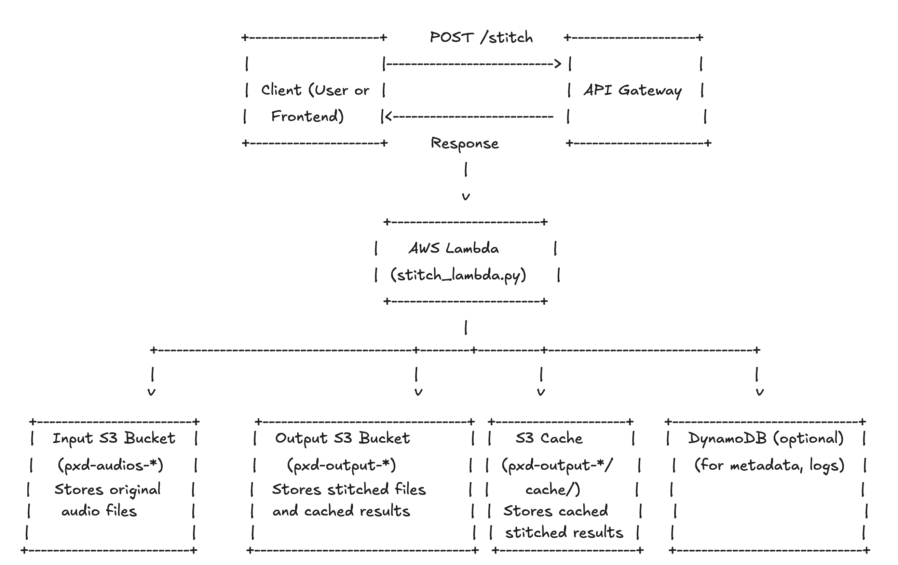

# AWS/Python Technical Assessment

## Setup

In a linux terminal where python is installed and available, run:

```bash
bash setup.sh
```

Then record two audio files:

`hello.wav`: Say "hello" in this audio file
`shreeshail.wav`: Say your name in this audio file

Save them to `./audios` and execute:

```bash
bash run.sh
```

That will generate an audio file called `hello__shreeshail.mp3` which is a stitched audio of `hello.wav` and `shreeshail.wav`.

Try running the `stitch.py` script with different messages (once you record the appropriate audio files).

## How it works

The `stitch.py` script when running locally takes as input a text message, a root audio file directory, and the full file path of the stitched audio file that will be generated from the text message.

Once the input paramters are provided, it will generate a repository (in this case a local reposity) that
will be used to list all of the files in the root audio file directory.  It will also be used to load the
audio file contents and to save the stitched audio file.

## API Endpoint

**URL:**  
[API-Endpoint-Link](https://alnsxs4duwimivhdmxxc5ic6gu0jnczo.lambda-url.ap-south-1.on.aws/)

---

## Sample Response

```json
{
  "message": "Stitched audio retrieved from cache!",
  "audio_files": [
    "hello.wav",
    "shreeshail.wav"
  ],
  "download_stiched_file_url": "https://pxd-output.s3.amazonaws.com/cache/e71ec06db1189099284ce7327875.mp3?X-Amz-Algorithm=AWS4-HMAC-SHA256&...",
  "cached": true
}
```
- **message**: Describes the result (e.g., whether the stitched audio was retrieved from cache).
- **audio_files**: List of audio file names that were stitched.
- **public_url**: A secure, time-limited (presigned) URL to download or access the stitched audio file.
- **cached**: Boolean indicating whether the file was retrieved from cache (`true`) or newly generated (`false`).

**Note:**  
You can use the `download_stiched_file_url` to securely access and download the stitched audio file.


Architecture Diagram :

- 

- [Excalidraw](https://excalidraw.com/#json=bb6bLCWPNt7ZJU9Ntih-A,v4vVDNsrykl0aNlGH4YLxg)
---

## Flow

1. **Client** sends a request to the **API Gateway** (POST `/stitch` with audio file keys to stitch).
2. **API Gateway** triggers the **Lambda function**.
3. **Lambda** checks if a stitched version for the requested combination exists in the **Output S3 Bucket** under the `cache/` prefix.
    - If cached, returns the URL to the cached file.
    - If not, downloads audio parts from the **Input S3 Bucket**, stitches them, uploads the result to the cache area of the **Output S3 Bucket**, and returns the new URL.
4. **S3 Lifecycle rules** automatically remove old cache files after a set period.

---

## Key AWS Resources

- **API Gateway**: REST API entry point.
- **Lambda**: Runs the stitching, cache check, and S3 interaction logic.
- **Input S3 Bucket**: Holds user-uploaded audio files.
- **Output S3 Bucket**: Holds stitched and cached audio files.
- **IAM Roles**: Secure, least-privilege access for Lambda to S3.

---

## Security & Operations

- S3 Buckets are private by default.
- IAM roles defined per environment.
- S3 cache uses lifecycle expiration.
- Deployed/tested via CI/CD pipelines.

---
## Project Structure

```plaintext
.
├── src/
│   ├── stitch.py
│   ├── stitch_lambda.py
│   ├── bucket_repo.py
│   ├── TROUBLESHOOTING_GUIDE.md
│   ├── AUDIO_STICHER_DOCUMENT.md
├── tests/ //TODO
│   └── test_stitch.py //TODO
├── serverless.yml //TODO
├── requirements.txt
├── run.sh
├── setup.sh
├── README.md
└── .github/ //TODO
    └── workflows/
        └── ci.yml
```


---

## Contributors

- [Shreeshail G](mailto:shreeshailgumgeri@gmail.com)
